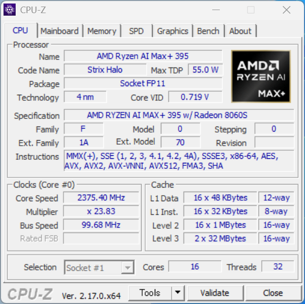
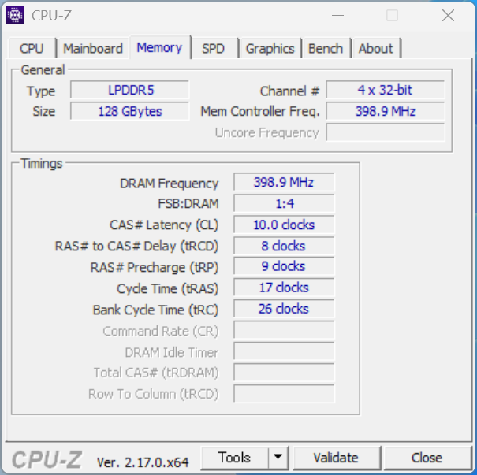
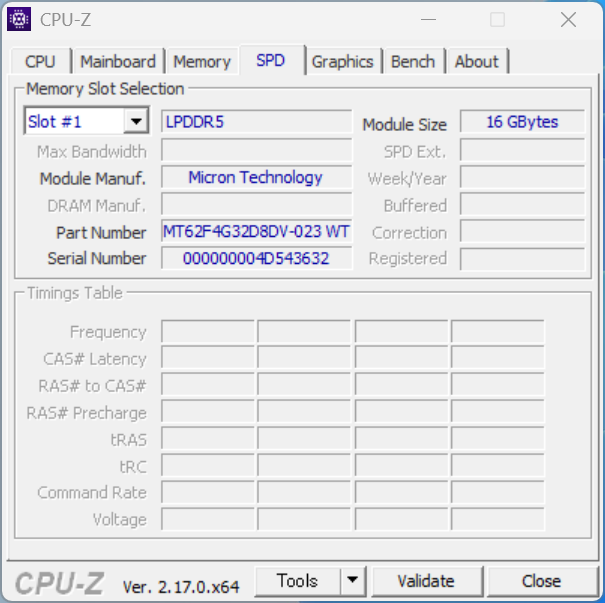
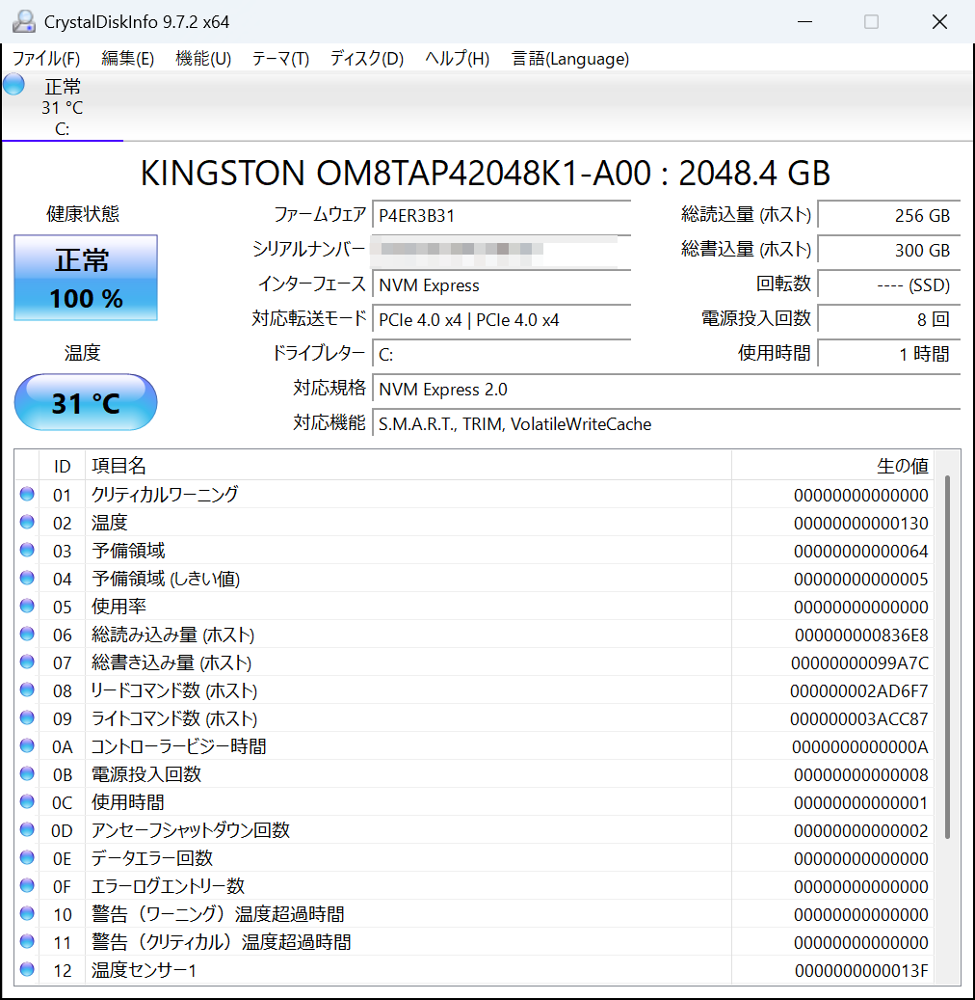
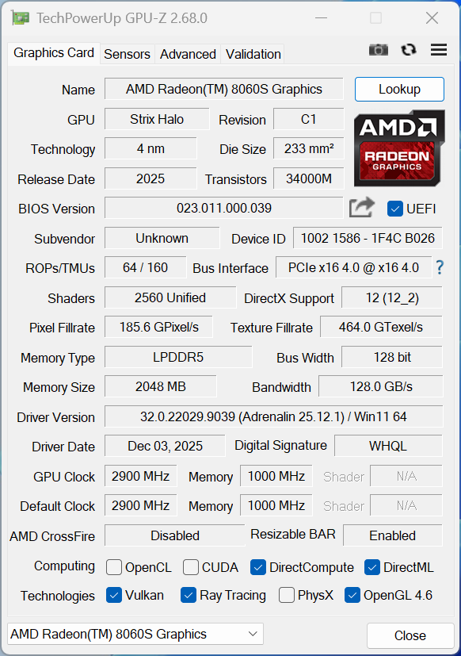
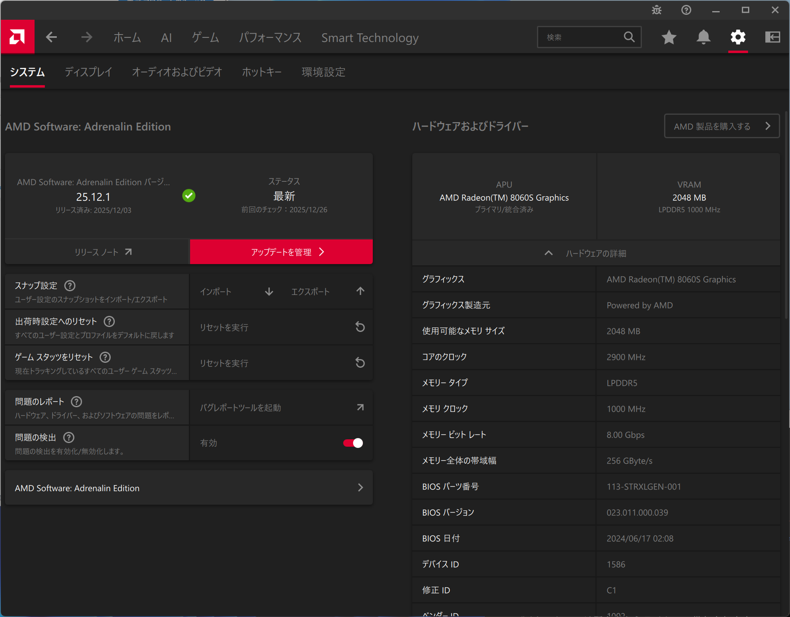
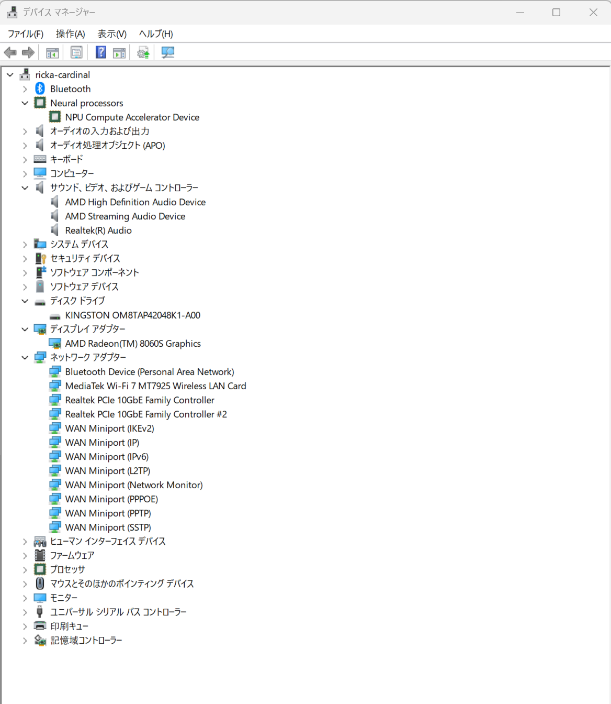

# MS-S1 MAX概要

## 外見
金属製の筐体で、見た目以上にずっしりしています。滑り止めは2面に貼られており、縦・横どちらでも設置できます。

前面インターフェースはUSB Type-A x1、USB Type-C x2、イヤホンジャック。
背面インターフェースはHDMI、USB Type-A x4、USB Type-C x2、RJ-45 x2です。

なお前面のUSB Type-Aのポートは上下が逆転しています。端子を裏返しにしないと挿さりません。

## ハードウェア

### CPU

Ryzen AI Max+ 395を搭載しています。16コア32スレッドという、モバイル向けプロセッサとは思えない数値が目を引きます。

物理的には8コアぶんのCCDが2つ載る構成です。共有キャッシュのL3もCCDごとにあるため2つ検出しています。



### メモリ

LPDDR5-8000 128GBのメモリを搭載しています。オンボードのため交換・増設はできません。チップはMicron製でした。




### SSD

型番によれば [M.2 2280 QLC PCIe Industrial NVMe SSD](https://www.kingston.com/jp/industrial-ssd/m2-2280-qlc-pcie-nvme) の2TBです。

仕様上、連続読み取り/書き込みは「最大6,100/5,400MB/秒」となっています。実際の性能がどうかはストレージのベンチマークでチェックしましょう。



### GPU

専用のVRAMを持たないiGPUでありながら、高速なメインメモリを搭載したことで128GB/sものメモリ帯域を誇ります。ミドルローレンジのdGPU（Radeon RX6400など）に匹敵する数値です。

デフォルトではMemory Size（ビデオメモリ）は2048MBとなっていますが、割り当て量はBIOSで変更できます。




### その他

無線チップはMediaTek、有線LANはRealtek製です。メジャーな製品でそろえているようです。




## ソフトウェア

開封直後のプリインストールソフトウェアを以下のコマンドで出力しました。

```bat
winget list > preinstall.txt
```

国内メーカーのPCと異なり、余計な付属ソフトはほとんどありません。

しいていえば `Windows Driver Testing Framework` やVC++のランタイムが気になります。開発用のイメージをそのままマスターにしてしまったのでしょうか。

[preinstall.txt](preinstall.txt) 

## 消費電力

システム全体の消費電力をワットチェッカーで計測します。

* アイドル時  13~14W
* LLMベンチマークのモデル読み込み中 40~45W
* ベンチマーク中 130～175W

負荷を最大にした状態でおおよそ180Wとみてよさそうです。
