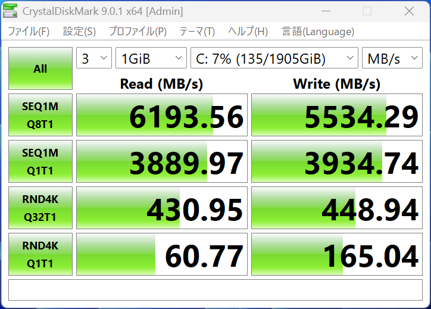
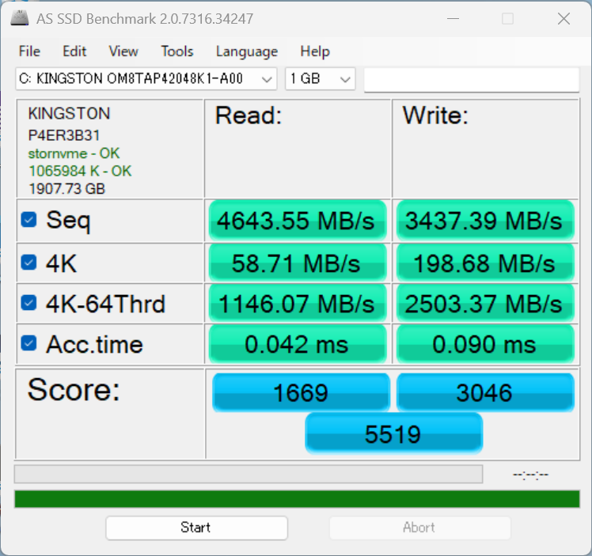
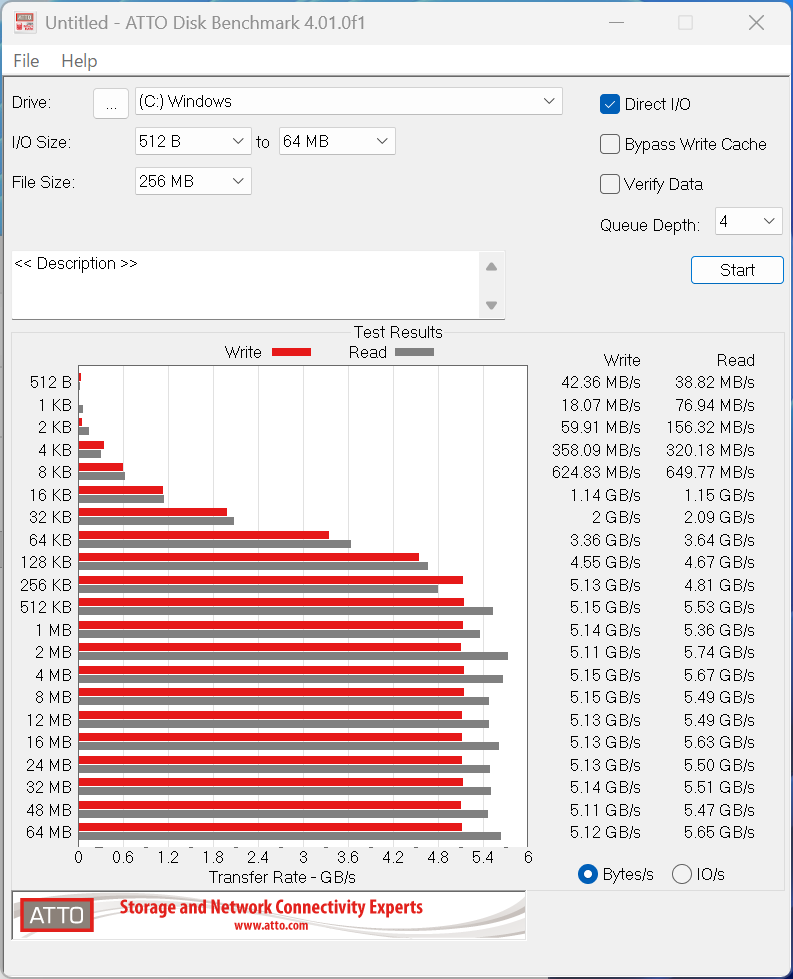
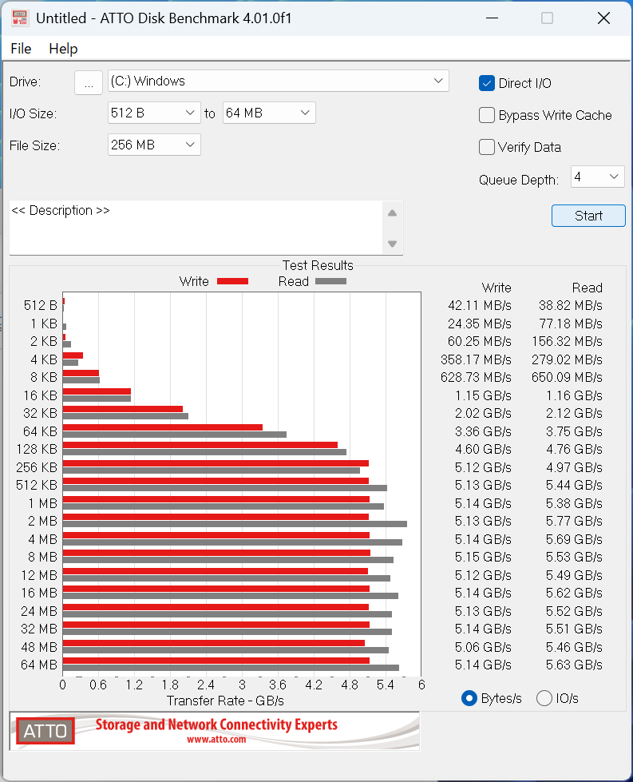

# ストレージ

型番によれば[M.2 2280 QLC PCIe Industrial NVMe SSD](https://www.kingston.com/jp/industrial-ssd/m2-2280-qlc-pcie-nvme) の2TBです。

連続読み取り/書き込みは「最大6,100/5,400MB/秒」となっています。

## CrystalDiskMark
シーケンシャルリード6193MB/s、シーケンシャルライト5534MB/sを記録しています。カタログスペックどおりの性能が出ています。ローカルAIを動かすためにこのPCを使うのであれば重要なのはシーケンシャルリードの性能ですので、まず満足できる結果です。

## AS SSD Benchmark

## ATTO Disk Benchmark

