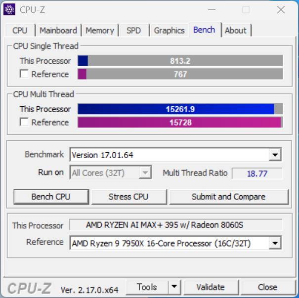
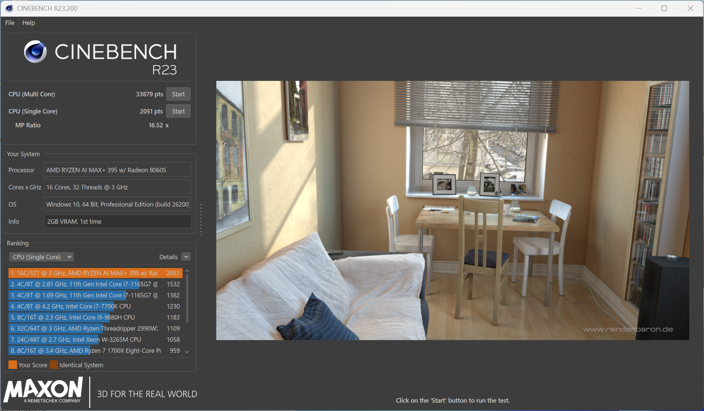

# CPU

## CPU-Zベンチマーク

おおよそRyzen 9 7950Xと同等。もちろんベンチマークという特殊な環境ということを割り引く必要はありますが、前世代のハイエンドCPUに匹敵する性能というのは驚異的です。




他のプロセッサと比較したい場合は [CPU-Z Benchmark - CPU-Z VALIDATOR](https://valid.x86.fr/bench/1) を参照してください。

## Cinebench R23

Cinebenchは公式のランキングがありません。 [Maxon Cinebench Benchmark - OpenBenchmarking.org](https://openbenchmarking.org/test/pts/cinebench) などで比較してみると、シングルスレッド・マルチスレッドともにトップクラスの性能であることが読み取れます。



## 7-Zip

こちらも [7-Zip Compression Benchmark - OpenBenchmarking.org](https://openbenchmarking.org/test/pts/compress-7zip) で比較してみます。全体では77パーセンタイルの平凡なアッパーミドルに見えますが、これは上位をサーバー向けのCPUが独占しているためです。コンシューマー向けCPUでは最上位集団にあと一歩といったところ。

```bat
7z.exe b

7-Zip 25.01 (x64) : Copyright (c) 1999-2025 Igor Pavlov : 2025-08-03

Compiler:  MSC 1400.140040310
Windows 10.0 26200 : Microsoft Hv : Hv#1 : 10.0.26100.7.0.7462
x64 1A.7000 threads:32 128TB f:100007FB10E2774C
AMD RYZEN AI MAX+ 395 w/ Radeon 8060S
(B70F00 : AMD64 Family 26 Model 112 Stepping 0) (->) 2994 MHz

1T CPU Freq (MHz):  4241  4349  4354  4266  4337  4344  4351
16T CPU Freq (MHz): 1548% 4227   1445% 4332
32T CPU Freq (MHz): 1965% 3045   3126% 4666

RAM size:  128662 MB,  # CPU hardware threads:  32
RAM usage:   7119 MB,  # Benchmark threads:     32

                       Compressing  |                  Decompressing
Dict     Speed Usage    R/U Rating  |      Speed Usage    R/U Rating
         KiB/s     %   MIPS   MIPS  |      KiB/s     %   MIPS   MIPS

22:     183312  2809   6349 178327  |    2928281  3085   8092 249663
23:     160653  2630   6224 163686  |    2829790  3089   7927 244816
24:     163954  2883   6114 176284  |    2556491  2901   7732 224324
| 25:     159780  2991   6100 182432 | 2428071  2897   7457 216026 |
| ---------------------------------- | --------------------------- |
| Avr:    166925  2828   6197 175182 | 2685658  2993   7802 233707 |
Tot:            2911   6999 204445
```
