# GPU

## GPUメモリ割り当て

Ryzen AI Max+ 395には専用のVRAMは搭載されておらず、メインメモリの一部をビデオメモリとして割り当てます。デフォルトでは2GBがビデオメモリに割り当てられています。

### 設定変更方法

割り当ての設定はUEFIで変更します。

1. Windowsの管理者コマンドプロンプトから `shutdown /r /fw /t 0` で再起動してUEFIの設定画面に入ります
2. 「Advanced」→「AMD CBS」→「GFX Configuration」を開きます
3. 「UMA Frame buffer size」の設定を変更します

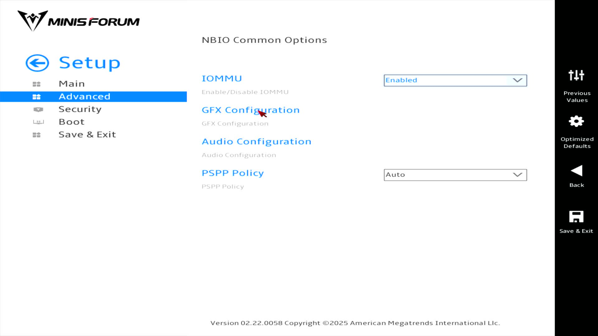
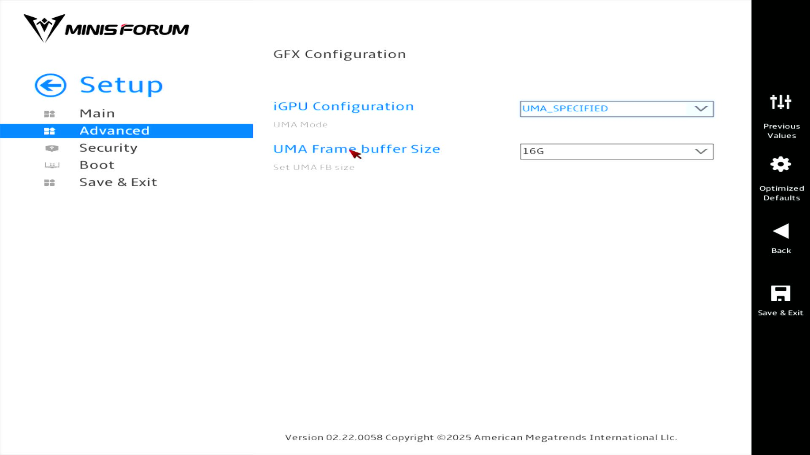

## ベンチマーク

以下のベンチマークではGPUメモリの設定を2GBと16GBそれぞれで性能の差を見ていきます。

### Blender

3回実施した平均です。

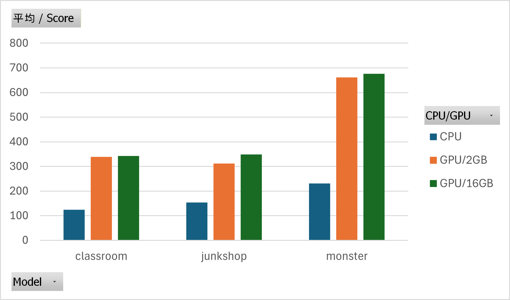

|モデル|CPU|2GB|16GB|
|--:|---|---|---|
|classroom|124.3|333.4|342.8|
|junkshop|153.7|312.3|348.7|
|monster|230.38|661.2|675.8|

### FurMark

FurMarkではOpenGLとVulkanの2種類のエンジンでベンチマークができます。こちらも3回実施した平均を載せています。

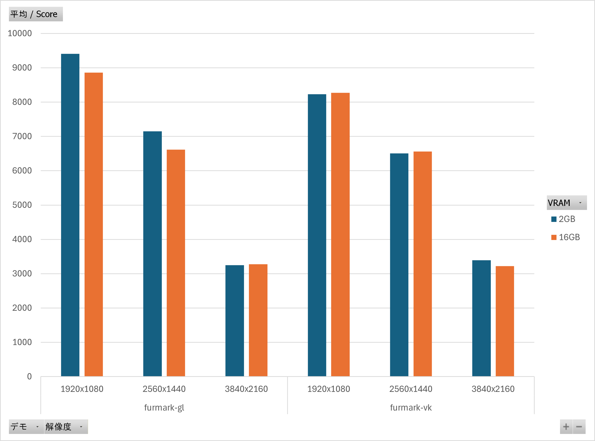

#### FurMark-gl（OpenGL）

|解像度|2GB|16GB|
|--:|---|---|
|1920x1080|9406|8860|
|2560x1440|7151|6615|
|3840x2160|3246|3277|

#### FurMark-vk（Vulkan）

|解像度|2GB|16GB|
|--:|---|---|
|1920x1080|8233|8268|
|2560x1440|6504|6563|
|3840x2160|3395|3221|

### GeekBench

メモリやVRAMを酷使するベンチではないため、ビデオメモリ量によるスコアの差はほとんどありません。

CPUのスコアは [Processor Benchmarks - Geekbench](https://browser.geekbench.com/processor-benchmarks/) で比較できます。

GPUのスコアは公式サイトに一覧表がないため比較がしづらくなっています。ざっと調べてみるとGeforce RTX2060 Superと同等程度のスコアといったところでしょうか。

|項目|2GB|16GB|
|--:|---|---|
|CPU|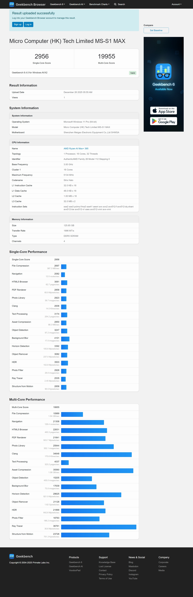||
|Vulkan|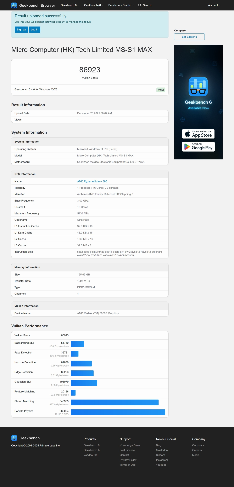||
|OpenCL|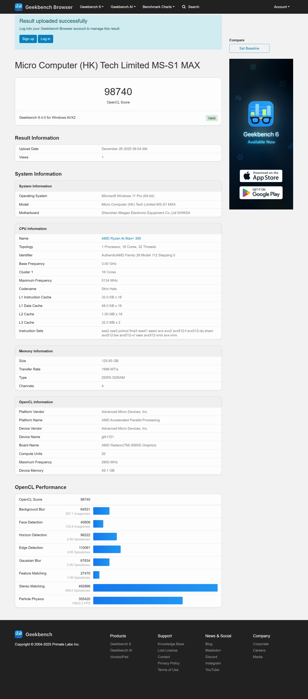||

### ゲームベンチマーク

比較的新しいゲームから「黒神話・悟空」のベンチマークを実行します。4Kでも平均60fpsをマークしていますが、実際のプレイにおいてはさらに高い負荷が予想されます。ゲームをプレイするうえではFullHDがよいでしょう。

|解像度|2GB|16GB|
|--:|---|---|
|1920x1080|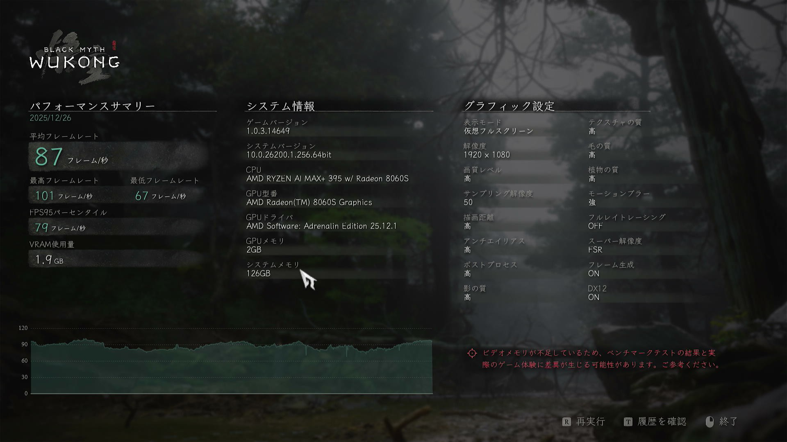|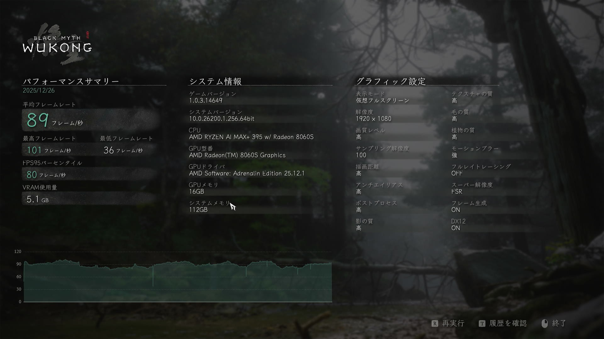|
|2560x1440|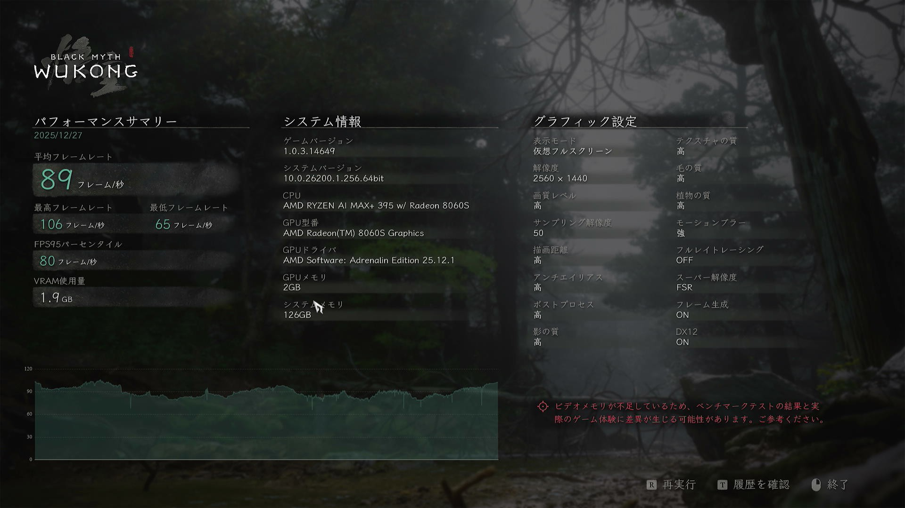|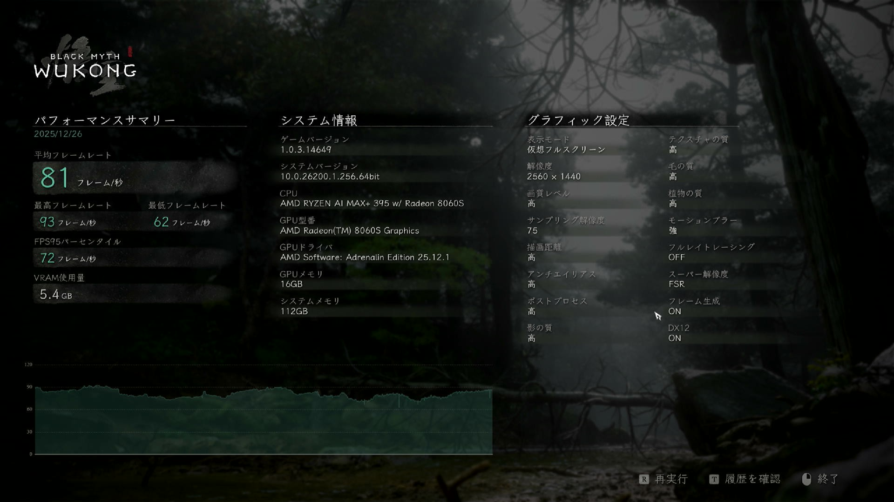|
|3840x2160||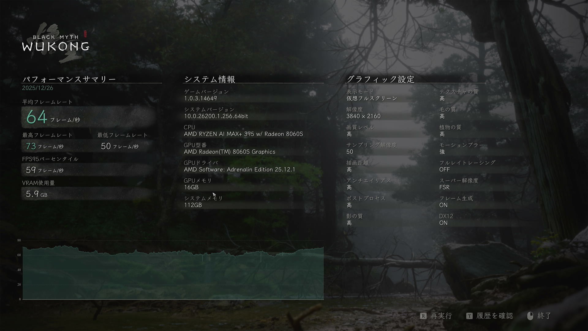|

### 考察

いずれのベンチマークでもGPUメモリの量によるスコアの差はほぼありません。特に「黒神話・悟空」では明確に「ビデオメモリが不足している」という警告が出ているにも関わらず顕著なパフォーマンスの低下が起きていません。

これは **共有GPUメモリ** によるものです。このPCでは専用GPUメモリとは別に共有GPUメモリがあります。専用GPUが不足すると共有GPUメモリを利用するため、共有GPUメモリに空きがある限りはGPUメモリの不足にはなりません。また、どちらも128GBのメインメモリの一部をGPUで使っているためメモリの帯域に差はなく、性能のボトルネックにもなっていないのでしょう。

以下のスクリーンショットはビデオメモリ2GBの設定で実行中の「黒神話・悟空」ベンチマークとタスクマネージャーです。専用GPUメモリの使用量は1.8GBとほぼ使い切っており、それと同時に共有GPUメモリを4.2GB消費していることが読み取れます。これらの合計は6.0GBとなり、GPUメモリ設定16GBのときのGPU使用量5.2GBと近い数字となっていることがわかります。

実際に使用可能なGPUメモリ量は設定から予想される以上に多いのです。

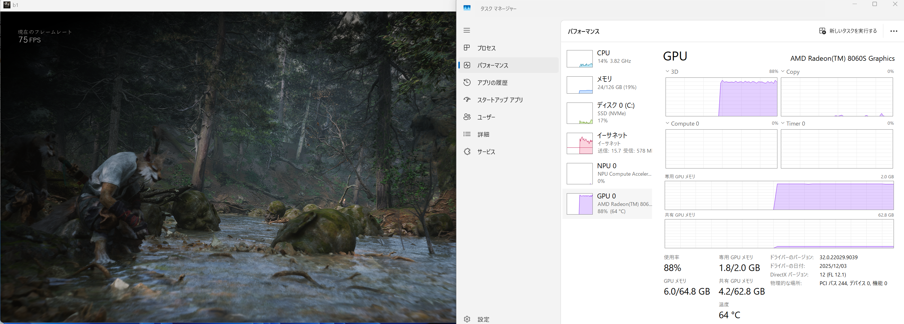

グラフィックス目的で使う場合、専用GPUメモリの設定は16GBにすれば十分でしょう。それ以上にしてもGPUの性能が追い付かないためあまり意味がありません。100GB以上残るメモリをどう活用するかが悩みどころとなります。

GPUメモリを限界まで使いたい分野で初めてこのPCのスペックに価値が出てきます。それがAI（LLMや画像生成）です。

## 参考：専用ビデオメモリ設定と共有ビデオメモリ量

|専用ビデオメモリ（GB）|	共有ビデオメモリ（GB）|合計（GB）|
|---:|---:|---:|
|1|	63.3|	64.3|
|2|	62.8|	64.8|
|4|	61.8|	65.8|
|8|	59.8|	67.8|
|16|	55.8|	71.8|
|32|	47.8|	79.8|
|64|	31.8|	95.8|
|96|	15.8|	111.8|
