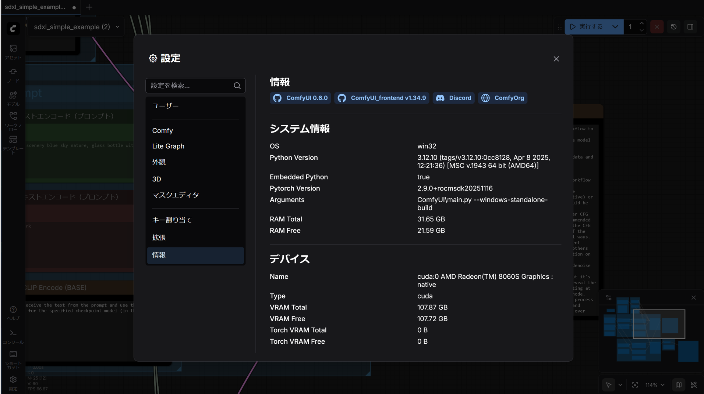
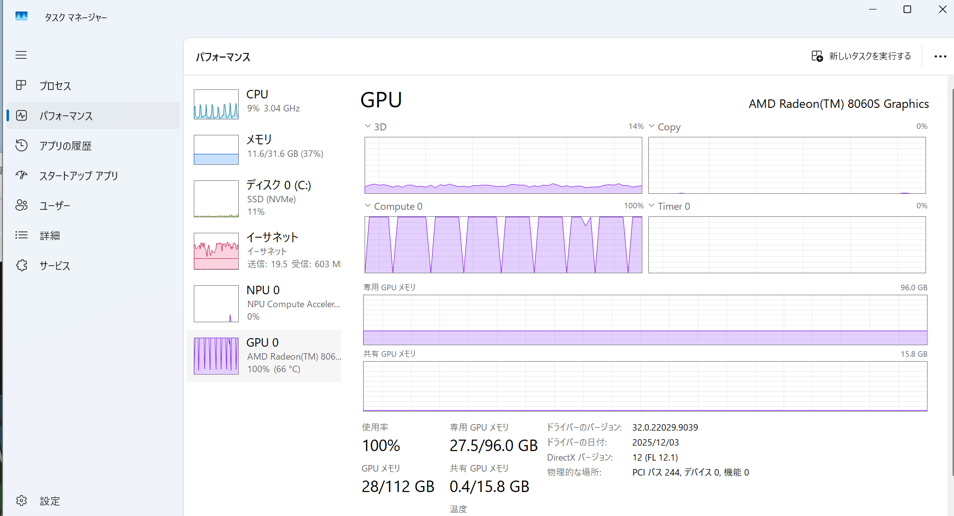

# ComfyUIによる画像生成

現在画像生成で定番となっているツールは [ComfyUI](https://github.com/comfyanonymous/ComfyUI) です。GitHubにあるWindows向けビルド済みポータブルイメージを使用します。


## 認識



ComfyUIからの認識ではTypeが `cuda` となっていますが実際にはROCｍで動作します。問題ありません。

## 実施

`SDXL Simple` のプリセットを使用して画像を生成します。初回はモデルファイルがないと警告が表示されますので、指示に従ってモデルをダウンロードし、配置します。配置先は `ComfyUI/Models/Checkpoints` です。



使用するビデオメモリは30GB以下です。LLMに比べるとはるかに動かしやすいといえます。もっとも画像生成ではまだ複数のGPUを活用できない場合も多いため、より大きなモデルでの画像生成でこそMS-S1 MAXが活躍できるとも考えられます。

以下は生成時のログです。1枚目はモデルの読み込みが入るため60秒以上かかりますが、以降は1枚あたり30秒強で生成ができています。

```
loaded diffusion model directly to GPU
Requested to load SDXL
loaded completely; 95367431640625005117571072.00 MB usable, 4897.05 MB loaded, full load: True
100%|██████████████████████████████████████████████████████████████████████████████████| 20/20 [00:23<00:00,  1.16s/it]
100%|████████████████████████████████████████████████████████████████████████████████████| 5/5 [00:06<00:00,  1.27s/it]
Requested to load AutoencoderKL
loaded completely; 85054.00 MB usable, 159.56 MB loaded, full load: True
Prompt executed in 64.91 seconds
100%|██████████████████████████████████████████████████████████████████████████████████| 20/20 [00:22<00:00,  1.12s/it]
100%|████████████████████████████████████████████████████████████████████████████████████| 5/5 [00:06<00:00,  1.27s/it]
Prompt executed in 32.33 seconds
100%|██████████████████████████████████████████████████████████████████████████████████| 20/20 [00:22<00:00,  1.12s/it]
100%|████████████████████████████████████████████████████████████████████████████████████| 5/5 [00:06<00:00,  1.24s/it]
Prompt executed in 32.23 seconds
100%|██████████████████████████████████████████████████████████████████████████████████| 20/20 [00:22<00:00,  1.12s/it]
100%|████████████████████████████████████████████████████████████████████████████████████| 5/5 [00:06<00:00,  1.24s/it]
Prompt executed in 32.16 seconds
100%|██████████████████████████████████████████████████████████████████████████████████| 20/20 [00:22<00:00,  1.12s/it]
100%|████████████████████████████████████████████████████████████████████████████████████| 5/5 [00:06<00:00,  1.24s/it]
Prompt executed in 32.18 seconds
100%|██████████████████████████████████████████████████████████████████████████████████| 20/20 [00:22<00:00,  1.12s/it]
100%|████████████████████████████████████████████████████████████████████████████████████| 5/5 [00:06<00:00,  1.25s/it]
Prompt executed in 32.23 seconds
100%|██████████████████████████████████████████████████████████████████████████████████| 20/20 [00:22<00:00,  1.12s/it]
100%|████████████████████████████████████████████████████████████████████████████████████| 5/5 [00:06<00:00,  1.24s/it]
Prompt executed in 32.23 seconds
100%|██████████████████████████████████████████████████████████████████████████████████| 20/20 [00:21<00:00,  1.09s/it]
100%|████████████████████████████████████████████████████████████████████████████████████| 5/5 [00:06<00:00,  1.21s/it]
Prompt executed in 31.28 seconds
```

### 出力例

出力できた画像の例です。いびつな形のものもありますが、おおむねよくできているのではないでしょうか。SDXLはやや古いモデルですので、最新のモデルでプロンプトを工夫するともっとよい出力もできそうです。


ちなみに画像のメタデータ（ `prompt` と `workflow` ）に生成時の情報が格納されています。これを使うと他の人が作った画像を自分でも再現できます。以下は上記画像の `prompt` です。

```jsonc
// prompt
{"4": {"inputs": {"ckpt_name": "sd_xl_base_1.0.safetensors"}, "class_type": "CheckpointLoaderSimple", "_meta": {"title": "Load Checkpoint - BASE"}}, "5": {"inputs": {"width": 1024, "height": 1024, "batch_size": 1}, "class_type": "EmptyLatentImage", "_meta": {"title": "\u7a7a\u306e\u6f5c\u5728\u753b\u50cf"}}, "6": {"inputs": {"text": "evening sunset scenery blue sky nature, glass bottle with a galaxy in it", "clip": ["4", 1]}, "class_type": "CLIPTextEncode", "_meta": {"title": "CLIP\u30c6\u30ad\u30b9\u30c8\u30a8\u30f3\u30b3\u30fc\u30c9\uff08\u30d7\u30ed\u30f3\u30d7\u30c8\uff09"}}, "7": {"inputs": {"text": "text, watermark", "clip": ["4", 1]}, "class_type": "CLIPTextEncode", "_meta": {"title": "CLIP\u30c6\u30ad\u30b9\u30c8\u30a8\u30f3\u30b3\u30fc\u30c9\uff08\u30d7\u30ed\u30f3\u30d7\u30c8\uff09"}}, "10": {"inputs": {"add_noise": "enable", "noise_seed": 530836220096415, "steps": 25, "cfg": 8.0, "sampler_name": "euler", "scheduler": "normal", "start_at_step": 0, "end_at_step": 20, "return_with_leftover_noise": "enable", "model": ["4", 0], "positive": ["6", 0], "negative": ["7", 0], "latent_image": ["5", 0]}, "class_type": "KSamplerAdvanced", "_meta": {"title": "KSampler (Advanced) - BASE"}}, "11": {"inputs": {"add_noise": "disable", "noise_seed": 0, "steps": 25, "cfg": 8.0, "sampler_name": "euler", "scheduler": "normal", "start_at_step": 20, "end_at_step": 10000, "return_with_leftover_noise": "disable", "model": ["12", 0], "positive": ["15", 0], "negative": ["16", 0], "latent_image": ["10", 0]}, "class_type": "KSamplerAdvanced", "_meta": {"title": "KSampler (Advanced) - REFINER"}}, "12": {"inputs": {"ckpt_name": "sd_xl_refiner_1.0.safetensors"}, "class_type": "CheckpointLoaderSimple", "_meta": {"title": "Load Checkpoint - REFINER"}}, "15": {"inputs": {"text": "evening sunset scenery blue sky nature, glass bottle with a galaxy in it", "clip": ["12", 1]}, "class_type": "CLIPTextEncode", "_meta": {"title": "CLIP\u30c6\u30ad\u30b9\u30c8\u30a8\u30f3\u30b3\u30fc\u30c9\uff08\u30d7\u30ed\u30f3\u30d7\u30c8\uff09"}}, "16": {"inputs": {"text": "text, watermark", "clip": ["12", 1]}, "class_type": "CLIPTextEncode", "_meta": {"title": "CLIP\u30c6\u30ad\u30b9\u30c8\u30a8\u30f3\u30b3\u30fc\u30c9\uff08\u30d7\u30ed\u30f3\u30d7\u30c8\uff09"}}, "17": {"inputs": {"samples": ["11", 0], "vae": ["12", 2]}, "class_type": "VAEDecode", "_meta": {"title": "VAE\u30c7\u30b3\u30fc\u30c9"}}, "19": {"inputs": {"filename_prefix": "ComfyUI", "images": ["17", 0]}, "class_type": "SaveImage", "_meta": {"title": "\u753b\u50cf\u3092\u4fdd\u5b58"}}}
```