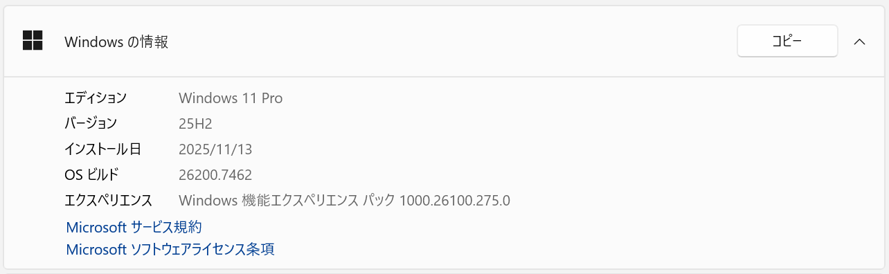

# Minisforum MS-S1 MAXレビュー

これは株式会社リッカ有志による [Minisforum MS-S1 MAX](https://www.minisforum.jp/products/ms-s1-max) のレビューです。

ベンチマーク実施前にWindows Updateはすべて適用済み（OSビルド26200.7462）です。

## 概要

- [MS-S1 MAX概要](00_MS-S1_MAX概要/overview.md)
  - MS-S1 MAXのハードウェアとソフトウェアの情報です。

## ベンチマーク

- [ストレージ](01_ストレージ/storage.md)
  - SSDの速度を計測します。
- [CPU](02_CPU/cpu.md)
  - CPU-Z、CineBench、7-ZipでCPUの性能を計測します。
- [GPU](03_GPU/gpu.md)
  - Blender、FurMark、GeekBench、黒神話・悟空ベンチマーク等でGPUの性能を計測します。
  - ビデオメモリ割り当て量の変更方法も解説しています。

## AI活用

- [LLMベンチマーク](11_LLMベンチマーク/llm.md)
  - llama.cppでローカルLLMサーバーとしての性能を計測します。
- [LLM実用](12_LLM実用/llm_practical.md)
  - ローカルLLMサーバーとして本機を最大限に活用する方法を調べます。
- [画像生成](13_画像生成/ComfyUI.md)
  - LLM以外の活用方法として、ComfyUIを用いた画像生成の性能を調べます。
